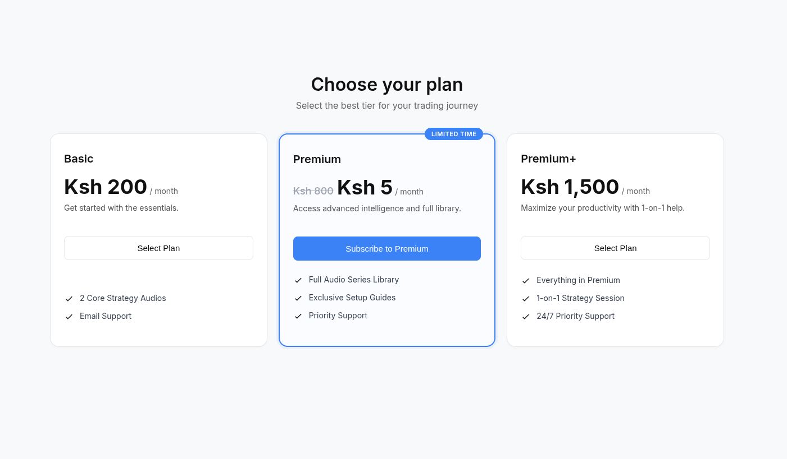

# 🚀 PayHero Python Subscription Boilerplate

<p align="center">
  
</p>

<p align="center">
  <strong>A production-ready Flask SaaS starter kit for M-Pesa payments using the PayHero API.</strong>
</p>

<p align="center">
  Build subscription platforms, membership sites, digital product stores, and SaaS applications with a complete M-Pesa payment workflow already implemented.
</p>

<p align="center">
  <a href="https://www.python.org/">
    
  </a>
  <a href="https://flask.palletsprojects.com/">
    
  </a>
  <a href="https://payhero.co.ke/">
    
  </a>
  <a href="LICENSE">
    
  </a>
</p>

---

## ✨ Features

### 💳 M-Pesa STK Push Integration

Trigger payment requests directly to customer phones using the PayHero API.

### 📡 Webhook Callback Processing

Receive and process payment confirmations asynchronously through dedicated Flask webhook endpoints.

### 🔄 Real-Time Payment Status Tracking

Automatic frontend polling updates transaction status without page refreshes.

### 🎨 Modern Subscription UI

Responsive pricing cards with support for multiple subscription plans.

### 🔒 Secure Configuration

Environment-based configuration using `.env` files and `python-dotenv`.

### 📱 Mobile-First Design

Optimized for smartphones, tablets, and desktop devices.

### ⚡ Production-Ready Foundation

Designed as a starting point for SaaS products, subscription services, digital marketplaces, and membership platforms.


## 🎯 Use Cases

This boilerplate can be adapted for:

* SaaS subscriptions
* Membership platforms
* Online learning systems
* Digital product stores
* Premium content websites
* E-commerce platforms
* Event ticketing systems
* Donation platforms

---

## 🛠 Technology Stack

| Technology        | Purpose                   |
| ----------------- | ------------------------- |
| Python 3.8+       | Backend Development       |
| Flask             | Web Framework             |
| PayHero API       | M-Pesa Payment Processing |
| JavaScript (ES6+) | Frontend Logic            |
| HTML5/CSS3        | User Interface            |
| Ngrok             | Webhook Testing           |

---

## 📂 Project Structure

```text
payhero-python-subscription/
│
├── app.py
├── .env
├── .env.example
├── .gitignore
├── requirements.txt
├── README.md
│
├── screenshots/
│   ├── hero-preview.png
│   ├── pricing-page.png
│   ├── payment-processing.png
│   ├── payment-success.png
│   └── mobile-view.png
│
└── templates/
    ├── index.html
    └── success.html
```

---

## 🚀 Quick Start

### Prerequisites

Before getting started, ensure you have:

* Python 3.8+
* A PayHero merchant account
* API Username
* API Password
* Account ID
* Channel ID
* Ngrok (for local webhook testing)

---

### 1. Clone the Repository

```bash
git clone https://github.com/valentino-scott/payhero-python-subscription.git

cd payhero-python-subscription
```

---

### 2. Create a Virtual Environment

```bash
python3 -m venv venv

source venv/bin/activate
```

Windows:

```bash
venv\Scripts\activate
```

---

### 3. Install Dependencies

```bash
pip install -r requirements.txt
```

---

### 4. Configure Environment Variables

Create a `.env` file:

```env
API_USERNAME=your_payhero_username
API_PASSWORD=your_payhero_password
ACCOUNT_ID=your_account_id
CHANNEL_ID=your_channel_id
PUBLIC_URL=https://your-ngrok-url.ngrok-free.app
```

---

### 5. Run the Application

```bash
python app.py
```

Open:

```text
http://127.0.0.1:5000
```

---

## 🧪 Testing Webhooks with Ngrok

Because M-Pesa confirmations are asynchronous, PayHero requires a publicly accessible callback URL.

Start Ngrok:

```bash
ngrok http 5000
```

Copy the generated HTTPS URL:

```text
https://xxxx.ngrok-free.app
```

Update your `.env`:

```env
PUBLIC_URL=https://xxxx.ngrok-free.app
```

Restart the Flask application.

---

## 💳 Making a Test Payment

1. Open the application in your browser.
2. Select a subscription plan.
3. Enter a valid M-Pesa phone number.
4. Click **Subscribe Now**.
5. Confirm the payment on your phone.
6. Watch the payment status update automatically.

---

## 🔒 Security

This project follows basic security best practices:

* Environment variables stored outside source code
* `.env` ignored by Git
* Webhook endpoint separation
* Server-side payment verification
* Secure credential handling

Before deploying to production, ensure:

* HTTPS is enabled
* Secrets are stored securely
* Logging is configured
* Rate limiting is implemented
* Webhook signatures are validated

---

## 🚀 Deployment

This project can be deployed on:

* Render
* Railway
* DigitalOcean
* VPS Servers
* AWS
* Azure
* Google Cloud

Simply configure your environment variables and deploy the Flask application.

---

## 🗺 Roadmap

Planned improvements:

* User authentication
* Admin dashboard
* Subscription management
* Payment history
* Email receipts
* Multi-tenant support
* Analytics dashboard
* Recurring billing support

---

## 🤝 Contributing

Contributions are welcome and appreciated.

To contribute:

```bash
git checkout -b feature/amazing-feature
```

Commit your changes:

```bash
git commit -m "Add amazing feature"
```

Push your branch:

```bash
git push origin feature/amazing-feature
```

Then open a Pull Request.

For major changes, please open an issue first to discuss your proposal.

---

## ⭐ Support

If you find this project useful:

* Star the repository
* Fork the project
* Share it with other developers
* Contribute improvements

---

## 📄 License

Distributed under the MIT License.

See the `LICENSE` file for details.

---

## 👨‍💻 Author

### Valentino Scott

GitHub: @valentino-scott

Repository:

https://github.com/valentino-scott/payhero-python-subscription

---

<p align="center">
Built with ❤️ for the Kenyan developer community 🇰🇪
</p>
